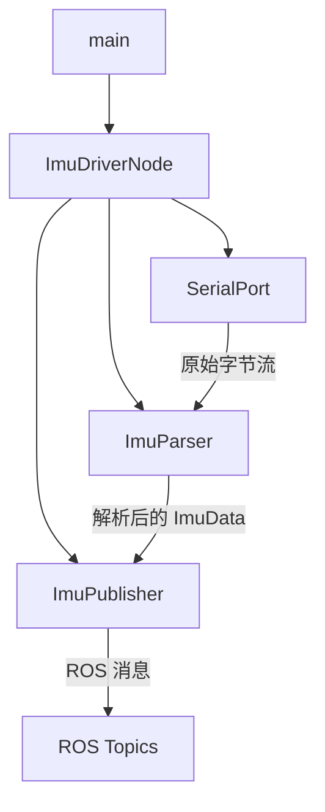

# IMU ROS Driver 优化计划

## 一、问题总览

### 🔴 严重 Bug（编译/运行错误）

| # | 文件 | 问题 | 影响 |
|---|------|------|------|
| 1 | `CMakeLists.txt:5` | `CMAKE_BUILE_TYPE` 拼写错误，应为 `CMAKE_BUILD_TYPE` | Release 构建从未生效，性能损失 |
| 2 | `src/imu_ros_publisher.cpp:126-143` | 引用 `custom_msg.ax/ay/az/wx/wy/wz/hx/hy/hz`，但 `ImuData.msg` 无这些字段 | **编译失败** |
| 3 | `CMakeLists.txt:41` | `add_dependencies` 中有多余的 `}` | 可能导致构建错误 |

### 🟡 代码质量问题

| # | 文件 | 问题 | 影响 |
|---|------|------|------|
| 4 | `src/imu_ros_publisher.cpp:14` | 全部逻辑在 `main()` 中，~160行单函数 | 可维护性差 |
| 5 | `src/imu_ros_publisher.cpp:50-55` | `to_i16`/`to_f` lambda 在循环内重建 | 微小性能损失，代码异味 |
| 6 | `src/imu_ros_publisher.cpp:58` | `uint8_t tmp[256]` 硬编码魔数 | 可读性差 |
| 7 | `src/imu_ros_publisher.cpp:72` | `buf.erase(buf.begin(), buf.end() - 3)` 当 `buf.size() <= 3` 时行为未定义 | 潜在崩溃 |
| 8 | `src/imu_ros_publisher.cpp:150` | `buf.erase(buf.begin(), buf.begin() + pos + 24)` 可能越界 | 潜在崩溃 |
| 9 | `src/imu_ros_publisher.cpp:60` | `read_some` 无超时机制 | 串口断开时永久阻塞 |
| 10 | `src/imu_ros_publisher.cpp:123-124` | 协方差矩阵先全填0再改一个值 | 冗余代码 |
| 11 | `CMakeLists.txt:6` | 用 `CMAKE_CXX_FLAGS` 设 C++ 标准，已弃用 | 不符合现代 CMake 规范 |

### 🟢 架构/设计改进

| # | 问题 | 建议 |
|---|------|------|
| 12 | 串口通信、协议解析、消息发布耦合 | 拆分为独立类 |
| 13 | `inc/` 和 `src/algorithm/` 目录为空 | 利用起来放置新类 |
| 14 | 无运行时参数重配置 | 添加 dynamic_reconfigure 支持 |
| 15 | 无诊断功能 | 添加连接状态监控、数据统计 |
| 16 | README 不完整 | 补充协议格式、参数文档、故障排除 |

---

## 二、重构架构设计

### 目标架构



### 类职责划分

#### 1. `SerialPort` 类 — 串口通信封装

- **文件**: `inc/serial_port.h` / `src/serial_port.cpp`
- **职责**:
  - 打开/关闭串口
  - 带超时的读取操作
  - 串口错误处理与自动重连
- **关键接口**:
  ```cpp
  class SerialPort {
  public:
      SerialPort(const std::string& port, int baud, int timeout_ms = 100);
      bool open();
      void close();
      bool isOpen() const;
      size_t read(uint8_t* buf, size_t max_len);  // 带超时
      void setTimeout(int timeout_ms);
  private:
      boost::asio::io_service io_;
      std::unique_ptr<boost::asio::serial_port> serial_;
      std::string port_;
      int baud_;
      int timeout_ms_;
  };
  ```

#### 2. `ImuParser` 类 — 协议解析

- **文件**: `inc/imu_parser.h` / `src/imu_parser.cpp`
- **职责**:
  - 字节流缓冲与帧同步
  - 校验和验证
  - 字段提取与缩放
- **关键接口**:
  ```cpp
  struct ImuRawData {
      int16_t ax, ay, az;
      int16_t wx, wy, wz;
      int16_t hx, hy, hz;
      bool valid;
  };

  class ImuParser {
  public:
      ImuParser();
      void feed(const uint8_t* data, size_t len);
      bool parse(ImuRawData& out);  // 返回是否解析出完整帧
  private:
      std::vector<uint8_t> buf_;
      static constexpr uint8_t HEADER[4] = {0x4E, 0x4A, 0x13, 0x01};
      static constexpr size_t FRAME_SIZE = 24;
      static constexpr size_t CHECKSUM_SIZE = 2;
      static constexpr size_t DATA_SIZE = 22;
      bool validateChecksum(size_t pos) const;
      int16_t readI16(size_t offset) const;
  };
  ```

#### 3. `ImuPublisher` 类 — 消息发布

- **文件**: `inc/imu_publisher.h` / `src/imu_publisher.cpp`
- **职责**:
  - 管理 ROS Publisher
  - 消息构建与发布
  - 缩放系数应用
- **关键接口**:
  ```cpp
  class ImuPublisher {
  public:
      ImuPublisher(ros::NodeHandle& nh,
                   bool publish_custom, bool publish_sensor_msgs,
                   double accel_scale, double gyro_scale, double mag_scale,
                   const std::string& frame_id);
      void publish(const ImuRawData& raw, const ros::Time& stamp);
  private:
      ros::Publisher pub_custom_;
      ros::Publisher pub_imu_;
      ros::Publisher pub_mag_;
      bool publish_custom_;
      bool publish_sensor_msgs_;
      double accel_scale_, gyro_scale_, mag_scale_;
      std::string frame_id_;
  };
  ```

#### 4. `ImuDriverNode` 类 — 顶层协调

- **文件**: `inc/imu_driver_node.h` / `src/imu_driver_node.cpp`
- **职责**:
  - 读取参数
  - 组合上述三个类
  - 主循环控制
  - 诊断信息发布
- **关键接口**:
  ```cpp
  class ImuDriverNode {
  public:
      ImuDriverNode(ros::NodeHandle& nh);
      bool init();   // 初始化串口等
      void run();    // 主循环
      void shutdown();
  private:
      std::unique_ptr<SerialPort> serial_;
      std::unique_ptr<ImuParser> parser_;
      std::unique_ptr<ImuPublisher> publisher_;
      // 诊断统计
      size_t frames_ok_{0};
      size_t frames_fail_{0};
  };
  ```

### 重构后的文件结构

```
IMU_ROS_Driver/
├── CMakeLists.txt              # 修复 + 现代化
├── package.xml                 # 保持不变
├── README.md                   # 完善
├── msg/
│   └── ImuData.msg             # 保持不变
├── launch/
│   └── imu_ros_publisher.launch # 添加超时参数
├── inc/
│   ├── serial_port.h           # 新增
│   ├── imu_parser.h            # 新增
│   ├── imu_publisher.h         # 新增
│   └── imu_driver_node.h       # 新增
├── src/
│   ├── imu_ros_publisher.cpp   # 精简为 main 入口
│   ├── serial_port.cpp         # 新增
│   ├── imu_parser.cpp          # 新增
│   ├── imu_publisher.cpp       # 新增
│   └── imu_driver_node.cpp     # 新增
└── src/algorithm/              # 保留为空（未来扩展）
```

---

## 三、具体修改步骤

### 阶段 1：修复编译错误（紧急）

1. **修复 `CMakeLists.txt` 拼写错误**: `CMAKE_BUILE_TYPE` → `CMAKE_BUILD_TYPE`
2. **修复 `CMakeLists.txt` 弃用写法**: 删除 `CMAKE_CXX_FLAGS`，改用 `CMAKE_CXX_STANDARD 14` + `set(CMAKE_CXX_STANDARD_REQUIRED ON)`
3. **修复 `CMakeLists.txt` 多余 `}`**: `add_dependencies` 行修正
4. **修复编译错误**: `custom_msg.ax` 等改为 `custom_msg.linear_acceleration.x` 等，或使用中间变量

### 阶段 2：代码架构重构

5. **创建 `inc/serial_port.h` + `src/serial_port.cpp`**: 封装串口通信，添加超时机制
6. **创建 `inc/imu_parser.h` + `src/imu_parser.cpp`**: 封装协议解析，修复边界条件
7. **创建 `inc/imu_publisher.h` + `src/imu_publisher.cpp`**: 封装消息发布，优化协方差初始化
8. **创建 `inc/imu_driver_node.h` + `src/imu_driver_node.cpp`**: 顶层协调类
9. **重写 `src/imu_ros_publisher.cpp`**: 精简为 main 入口，仅创建 NodeHandle 和 ImuDriverNode
10. **更新 `CMakeLists.txt`**: 添加新源文件，使用 `target_compile_features` 设置 C++ 标准

### 阶段 3：健壮性增强

11. **修复 `ImuParser` 中的边界条件**: `buf.erase` 前检查 size，避免越界
12. **添加串口超时**: 使用 `boost::asio::deadline_timer` 实现同步读取超时
13. **添加串口自动重连**: 串口异常时尝试重新打开
14. **提取魔数为命名常量**: 帧大小、头标识、缓冲区大小等

### 阶段 4：文档与配置

15. **更新 `launch/imu_ros_publisher.launch`**: 添加 `timeout_ms` 参数
16. **完善 `README.md`**: 补充协议格式、参数说明、架构图、故障排除

---

## 四、关键修复细节

### 4.1 编译错误修复

当前代码第 126-143 行：
```cpp
// 错误：ImuData.msg 没有 ax/ay/az 等字段
imu_msg.linear_acceleration.x = to_f(custom_msg.ax, accel_scale);
```

修复方案 — 使用中间变量：
```cpp
// 先从 custom_msg 中提取原始值
double ax = custom_msg.linear_acceleration.x;
double ay = custom_msg.linear_acceleration.y;
// ...
imu_msg.linear_acceleration.x = ax * accel_scale;
```

### 4.2 buf.erase 边界修复

当前代码：
```cpp
// 第 72 行：buf.size() == 3 时，buf.end()-3 == buf.begin()，OK
// 但 buf.size() < 3 时，buf.end()-3 越界！
if (buf.size() > 3) buf.erase(buf.begin(), buf.end() - 3);
```

修复：
```cpp
if (buf.size() > 3) {
    buf.erase(buf.begin(), buf.end() - 3);
} else if (buf.size() > 0 && it == buf.end()) {
    // 保留最后几个字节（可能是部分 header）
    // 不做任何操作，等待更多数据
}
```

### 4.3 串口超时机制

```cpp
size_t SerialPort::read(uint8_t* buf, size_t max_len) {
    boost::system::error_code ec;
    size_t n = 0;

    // 使用 deadline_timer 实现超时
    boost::asio::deadline_timer timer(io_);
    timer.expires_from_now(boost::posix_time::milliseconds(timeout_ms_));
    timer.async_wait([&](const boost::system::error_code& ec_timer) {
        if (!ec_timer) {
            serial_->cancel();
        }
    });

    serial_->async_read_some(
        boost::asio::buffer(buf, max_len),
        [&](const boost::system::error_code& ec_read, size_t bytes_read) {
            if (!ec_read || ec_read == boost::asio::error::operation_aborted) {
                n = bytes_read;
            }
            timer.cancel();
        });

    io_.restart();
    io_.run_one();
    return n;
}
```

### 4.4 CMakeLists.txt 修复后完整内容

```cmake
cmake_minimum_required(VERSION 3.8)
project(imu_ros_driver)

set(CMAKE_BUILD_TYPE "Release")
set(CMAKE_CXX_STANDARD 14)
set(CMAKE_CXX_STANDARD_REQUIRED ON)

find_package(catkin REQUIRED COMPONENTS
  roscpp
  std_msgs
  message_generation
  sensor_msgs
  geometry_msgs
)

find_package(Boost REQUIRED COMPONENTS system)

include_directories(
  "inc"
  "src"
  ${catkin_INCLUDE_DIRS}
  ${Boost_INCLUDE_DIRS}
)

add_message_files(
  FILES
  ImuData.msg
)

generate_messages(DEPENDENCIES std_msgs geometry_msgs)

catkin_package(
  CATKIN_DEPENDS roscpp std_msgs message_runtime sensor_msgs geometry_msgs
)

# 主节点：多个源文件
add_executable(imu_ros_publisher
  src/imu_ros_publisher.cpp
  src/serial_port.cpp
  src/imu_parser.cpp
  src/imu_publisher.cpp
  src/imu_driver_node.cpp
)

add_dependencies(imu_ros_publisher
  ${PROJECT_NAME}_EXPORTED_TARGETS
  ${catkin_EXPORTED_TARGETS}
)

target_compile_features(imu_ros_publisher PUBLIC cxx_std_14)

target_link_libraries(imu_ros_publisher
  ${catkin_LIBRARIES}
  ${Boost_LIBRARIES}
)
```

---

## 五、风险与注意事项

1. **向后兼容**: 重构后 launch 文件参数保持不变，新增参数有默认值
2. **Boost.Asio 超时**: `io_.run_one()` 需要确保在单线程环境下使用
3. **消息兼容**: `ImuData.msg` 不做修改，确保已有订阅者不受影响
4. **C++ 标准**: 从 C++11 升级到 C++14，需确认构建环境支持（ROS Kinetic/Melodic 均支持）
